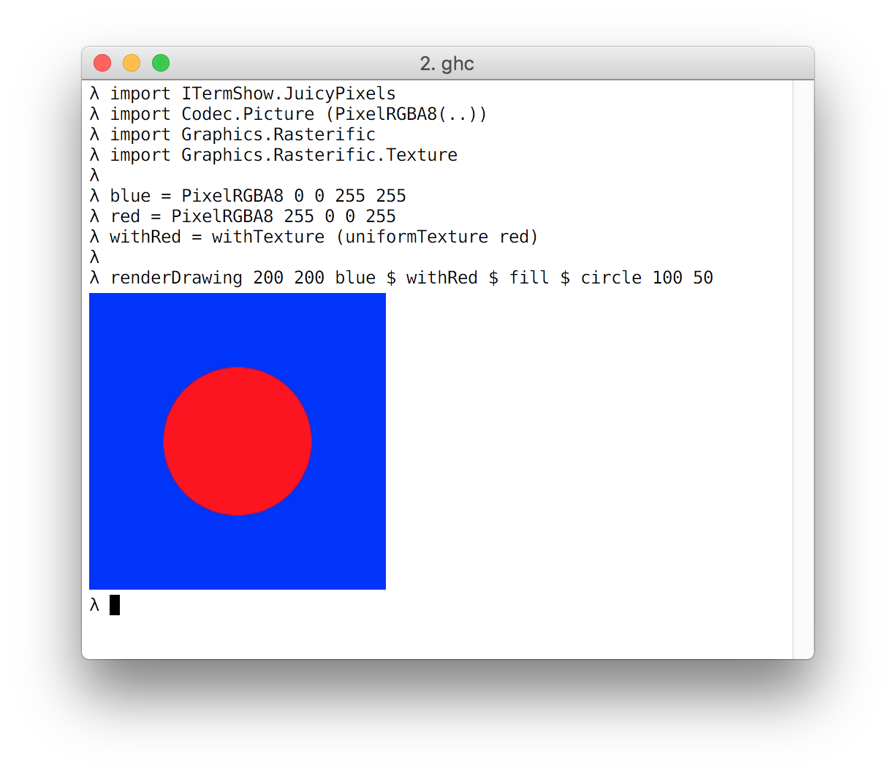

# iterm-show-JuicyPixels

This package provides orphan Show instances for a range of Image types in the
JuicyPixels package. These are very useful for experimenting in GHCi.

The Show instances work with terminals compatible with the iterm-show package.

